

# OSRS Toolkit

### Plan better trades. Remember what actually happened.

A free Windows app that sits next to the game. It works out what to flip with the cash and
Grand Exchange slots you actually have, keeps a journal of every trade you make, and later tells
you which of those plans were worth following. It also handles High Alchemy, skilling profit, and
boss gear checklists.

### [Download the latest Windows release](https://github.com/Wolklaw/OSRS-Toolkit/releases/latest)

**No login. Nothing plays the game for you. Your journal stays on your PC.**

[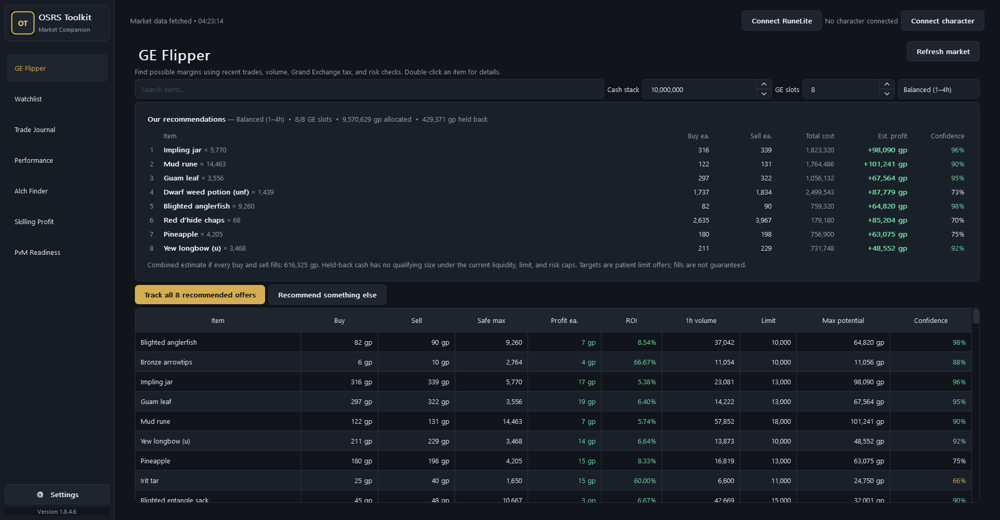](docs/images/ge-flipper.png)

## What's inside

| Page | What it's for |
|---|---|
| **[GE Flipper](#ge-flipper)** | Works out what to buy right now with the GP and free slots you have. |
| **[Watchlist](#watchlist)** | Keeps the items you care about in one table: margin after tax, ROI, volume, how recently they traded. |
| **[Trade Journal](#trade-journal)** | Every position from offer to payout, including partial fills, with profit that accounts for GE tax. |
| **[Performance](#performance)** | Looks back at your journal and tells you which strategies and items actually made you money. |
| **[RuneLite activity](#runelite-activity)** | Pulls your real GE fills in from the companion plugin so you don't have to type them out. |
| **[Alch Finder](#alch-finder)** | What's worth high-alching today, after nature runes and after what it costs to buy. |
| **[Skilling Profit](#skilling-profit)** | 83 skilling methods across 10 skills, priced off the live market. |
| **[PvM Readiness](#pvm-readiness)** | Compares your gear, bank, and levels against boss checklists: what you can do now, and what you're missing. |

Every page that needs market data shares the same copy of it. The app fetches prices quietly on
launch and every five minutes after that. **Refresh market** grabs them immediately without the
window locking up, and everything on screen updates together.

## Download

The [latest release](https://github.com/Wolklaw/OSRS-Toolkit/releases/latest) has two builds:

| Build | Best for | What you get |
|---|---|---|
| **Setup `.exe`** (recommended) | Most people | Normal installer, Start Menu entry, optional desktop shortcut, uninstaller, and updates that install themselves. |
| **Portable `.zip`** | A USB stick or a folder you keep | Unzip it anywhere and run `OSRS Toolkit.exe`. Nothing is installed. |

You don't need Python, PowerShell, or anything else installed first. The builds aren't code-signed
yet, so Windows may warn you about an **Unknown publisher**. Only download from this repository's
Releases page.

More detail further down:
[Do I need the plugin?](#do-i-need-the-plugin) ·
[Why prices look old](#market-data-fetch-time-vs-trade-age) ·
[Small things that make it nicer to use](#daily-use-details) ·
[Updates and privacy](#updates-privacy-and-game-boundaries) ·
[Quick start](#quick-start) ·
[Credits and license](#attribution-risk-and-license)

## GE Flipper

Type in how much GP you want to put to work, say how many slots are free (**1–8**), and pick
**Quick**, **Balanced**, or **Overnight**. It then plans those slots as one set rather than handing
you the top rows of a list — eight suggestions that each want your whole cash stack aren't a plan.

- It decides how much of each item to buy from your cash, your slot count, the four-hour buy limit,
  how much the item really trades, and how much risk the strategy you picked allows.
- Before trusting a price it checks the latest completed trades against the five-minute and
  one-hour averages.
- Items get dropped for prices that are too old, trading that's happening on only one side, prices
  moving around too much, profit that's too thin, or a margin too tight to survive the price
  slipping against you.
- For each pick you see the buy and sell prices to offer, the most you should safely buy, profit
  after tax, ROI, how much traded in the last hour, the buy limit, the best case, and a confidence
  score for how solid the underlying data is.
- It tells you how much of your GP it used and how much it deliberately left sitting. Leftover cash
  means nothing else cleared the checks, not that it ran out of ideas.
- Double-click any row for the full price breakdown. Send one offer, or the whole set, to the
  journal in a click.
- Don't fancy the top pick? **Recommend something else** swaps it for the next-best combination,
  and won't reuse anything it's already suggested this session.

[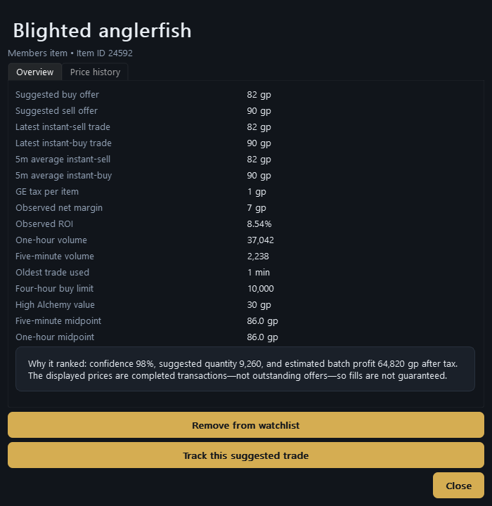](docs/images/item-details.png)

The prices shown are trades that already happened, not offers currently sitting in the GE.
Confidence is about how good that data is — it is not a promise the offer will fill or make money.
The **Price history** tab shows roughly the last 75 days of six-hour average buy and sell prices,
fetched in the background the first time you open it.

## Watchlist

[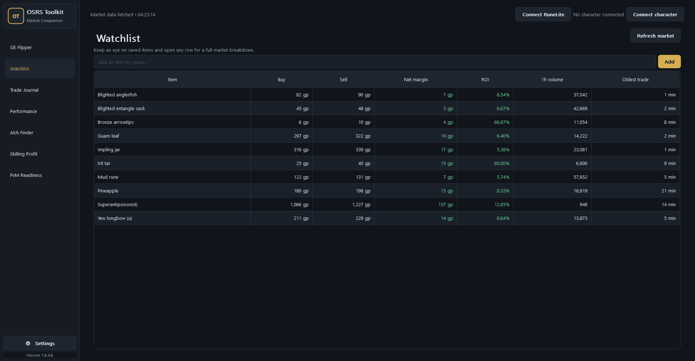](docs/images/watchlist.png)

Open an item from GE Flipper or Alch Finder and you can add it to the watchlist, where it stays
until you remove it. Double-click a saved row for its full latest, five-minute, and one-hour
figures, or drop it from the list there.

## Trade Journal

[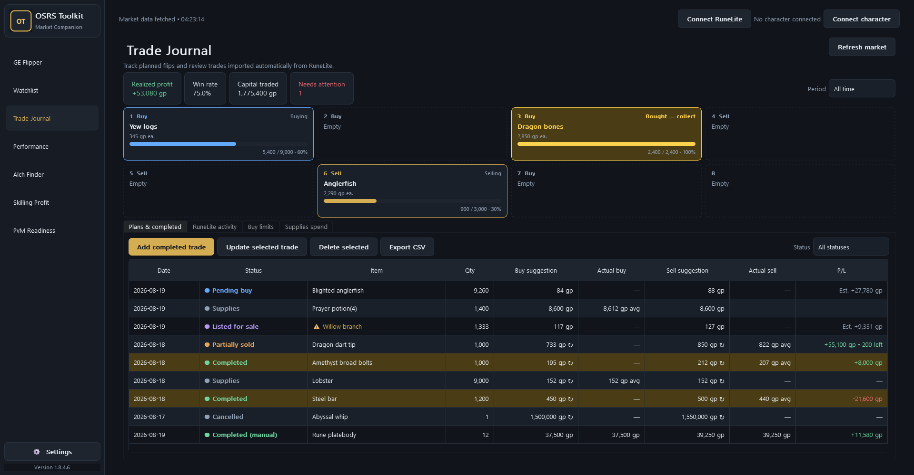](docs/images/trade-journal.png)

Anything you track arrives as **Pending buy**, keeping the quantity, strategy, and target prices it
was suggested with. From there it moves through **Bought**, **Listed for sale**,
**Partially sold**, **Completed**, or **Cancelled**.

- All eight GE slots sit above the journal, laid out the way the game lays them out, colour-coded
  for buying, selling, and done-and-waiting-to-collect.
- When a buy finishes and the item is yours to sell, the slot and its journal row flash yellow
  together — the row you need to deal with comes and finds you. The same flash marks a sale
  finishing, and any rows a newly tracked plan just created. If it happens while you're in-game,
  the sidebar holds a dot until you come back and look, then plays it.
- Standing at the Grand Exchange in-game, the rows you're trading highlight themselves: the row
  turns blue, with the quantity and the price for whichever side you're on picked out inside it.
  It follows the whole trade — the "Set up offer" box narrows it to the one item while you type,
  it stays put while the offer fills and while you collect, and it clears when you walk away.
- Click a GE slot to jump to that item's journal row. If your filters were hiding it, they open up.
- Record as many buy fills and sale fills as you need, at whatever quantities and prices you got.
  Both sides average out by quantity.
- Cancelled a buy halfway through? Set **Quantity acquired** to what actually filled and mark it
  **Bought** rather than Cancelled, and the stock you did get carries on through Listed for sale,
  Partially sold, and Completed.
- See your average buy and sale price, what's left to sell, and the realized result with GE tax
  taken off.
- Colour-coded statuses, a filter for active trades or any single status, and sorting by status in
  the order trades actually happen instead of alphabetically.
- Narrow the summary cards and finished rows to today, this week, this month, this year, a rolling
  range, or all time. Trades still in progress stay on screen whatever you pick.
- Projections are labelled as projections. Realized profit and loss is signed and colour-coded, so
  you can tell at a glance which is which.
- The original suggestion stays next to what really happened, even long after the market has moved.
- Double-click any row to update it. Trades you did without the toolkit can be typed in by hand.
- Realized profit, win rate, capital traded, and how many positions **need attention** are all
  visible at the top.
- Overnight positions keep the targets they were given, and get checked once a day against current
  suggestions when the market data is fresh enough. Quick and Balanced targets never move on their
  own — instead, a Listed for sale or Partially sold position gets flagged once your asking price
  is 2% or more above what the market now supports, because an ask that far out probably isn't
  going to fill.
- **Export CSV** writes out every tracked position and manual entry, ignoring whatever filters you
  currently have on.

[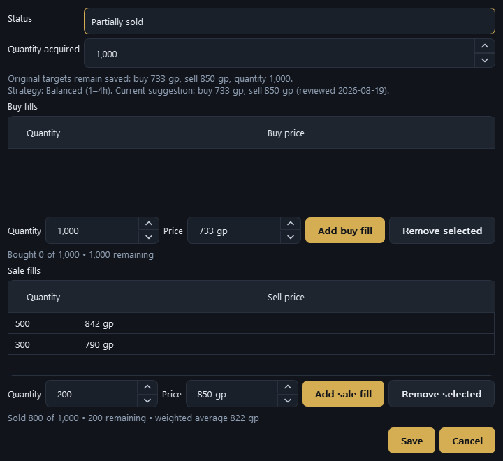](docs/images/trade-sale-fills.png)

The stats only count trades that have actually returned money, partially sold ones included.
Cancelled positions that never sold anything are left out of win rate entirely.

Your journal lives in a local database that survives app updates. The app keeps the last ten
startup backups, can find and move your data if an older version left it somewhere else, and
**Settings → Data** lets you put the database file wherever you want it.

## Performance

[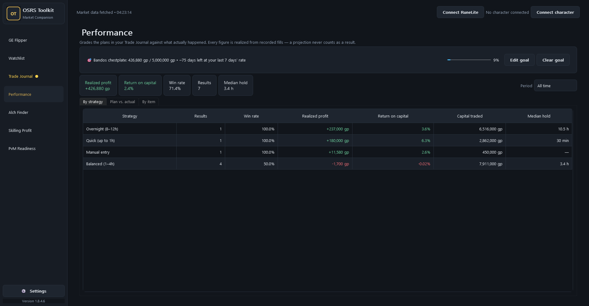](docs/images/performance-strategy.png)

The toolkit suggests a strategy and some target prices. The journal records what you really got.
**Performance** puts the two side by side, which is the point of keeping a journal at all.

- **By strategy.** Realized profit, win rate, return on capital, and typical hold time for each
  strategy you've traded under. It's comparing your results to your results — not the strategy
  descriptions to each other.
- **By item.** Which items actually make you money. Items you've flipped once are hidden unless you
  ask for them, since one flip tells you almost nothing.
- **Plan vs. actual.** The buy and sell targets you were given against the prices you really filled
  at, weighted by quantity, plus what those targets promised on the quantity that sold versus what
  it really made after tax.

[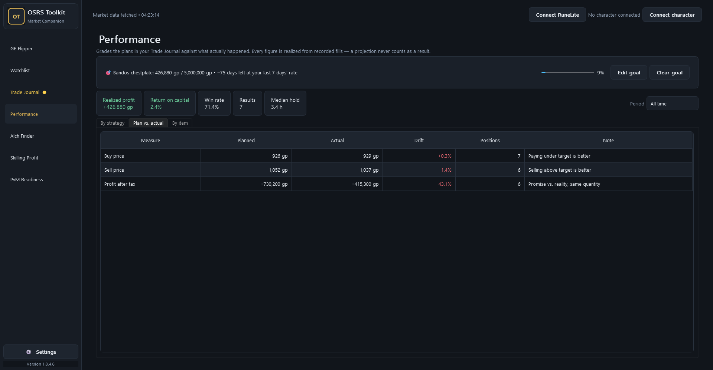](docs/images/performance-plan.png)

Every number here comes from fills you actually recorded; a projection never counts as a result.
Return on capital is weighted by how much money was tied up, so one big flip doesn't get averaged
away by a small lucky one, and a half-sold position only counts the half that sold. Buying below
your target is shown as the win it is, not as missing the mark.

The period filter and the history behind it match the Trade Journal exactly, so the two pages can
never tell you different things about the same trade. Trades you typed in yourself show up under
**Manual entry**; they never had a plan, so they sit out of Plan vs. actual. A position started
straight from a RuneLite offer uses that offer's own price as its target, so by definition it shows
no drift on the buy side.

## Do I need the plugin?

No. Everything that reads the market works on its own, and you can keep the journal by hand. The
plugin is there so you don't have to type in what you just did in-game.

**Works without it:**

- GE Flipper, Watchlist, Alch Finder, and Skilling Profit, in full. They only need prices.
- Hiding skilling methods above your levels — that's a public hiscores lookup on your display
  name, nothing to install.
- The whole Trade Journal, as long as you record buys and sells yourself. Statuses, partial fills,
  tax, filters, and CSV export all behave the same.
- Performance, in full, on whatever you've recorded. A plan you tracked from GE Flipper still gets
  graded against fills you typed in by hand.
- The yellow flash when you track a new plan.
- Themes, backups, moving the database, and updates.

**Needs the plugin:**

- Fills recorded for you — every buy and sell, partial or complete, including while the app is
  shut.
- Positions that open the moment you place an offer, and move to Listed for sale when you list
  something.
- The live eight-slot Grand Exchange panel above the journal.
- The yellow flash when a buy finishes or a sale closes out.
- The blue highlight that follows the row you're trading while you're stood at the GE.
- The RuneLite activity page itself, and player-to-player trade records (a second switch, also off
  by default).
- PvM Readiness verdicts. Without gear sync every boss reads **Unknown** — you still get the
  checklists, the requirements, and the GP/hr estimates, just not whether *you* can do it.

**What the plugin never does:** log into anything, click anything, change your offers, or send
your trades anywhere.

## RuneLite activity

Install and enable the separate
[OSRS Toolkit Sync companion plugin](https://github.com/Wolklaw/osrs-toolkit-runelite), then hit
**Connect RuneLite**. Your GE fills — partial and complete — get saved on your PC while RuneLite is
running, even if the desktop app is shut, and come across next time you open the toolkit.

[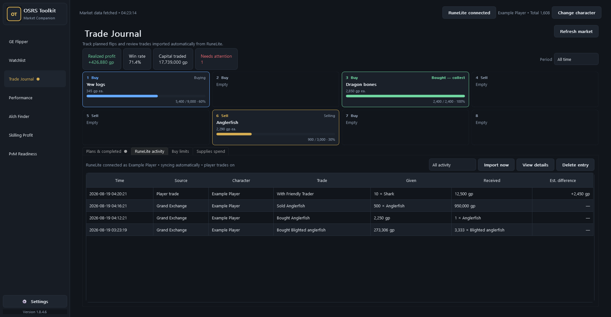](docs/images/runelite-activity.png)

- Fills wait in a file on your PC and each one carries its own ID, so nothing gets imported twice
  if something has to retry.
- You get the character, whether it was a buy or a sell, the item, quantity, coins, which slot, the
  price you set, and where the offer had got to.
- All the fills from one GE offer collapse into a single row that updates itself, rather than a new
  row every time a few more items trickle in.
- Filter to everything, GE fills only, or player trades, with details and the ability to delete.
- Player-to-player trade tracking is **off unless you turn it on**, and only records completed
  trades.
- Journal positions start the moment you place an offer, not when it fills: a buy offer opens a
  Pending buy for the full amount straight away, and putting something you already bought up for
  sale moves it to Listed for sale.
- If a buy fill arrives for something you weren't tracking, it starts a position sized to the whole
  order — so the rest of that order keeps landing on the same row instead of appearing out of
  nowhere once everything has filled.
- The plugin also reports where you're standing in the Grand Exchange, which is how the journal
  knows which row the game is currently asking you about. It's part of GE tracking, stops when that
  stops, and goes nowhere off your PC.
- PvM gear sync is **off unless you turn it on**. With it on, opening your bank in-game records
  your worn gear, inventory, bank, and levels for the PvM Readiness page. Again, nothing leaves
  your PC.
- The app knows whether you're online, and looks your character up on the public hiscores.

[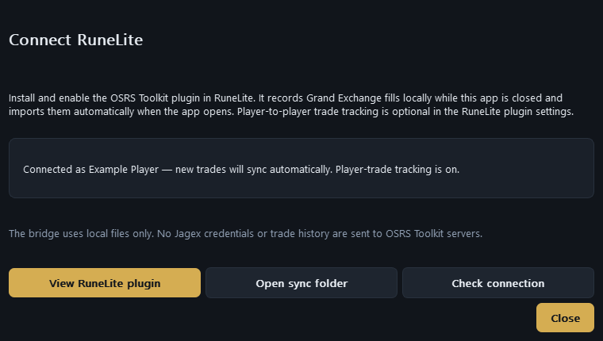](docs/images/runelite-connection.png)

The connection is just files on your computer. It doesn't click anything, doesn't touch your
offers, doesn't talk to game worlds, never asks for your Jagex login, and doesn't upload your trade
history anywhere. It also can't tell you about trades you made before installing it, while it was
switched off, or on mobile and other clients.

## Alch Finder

[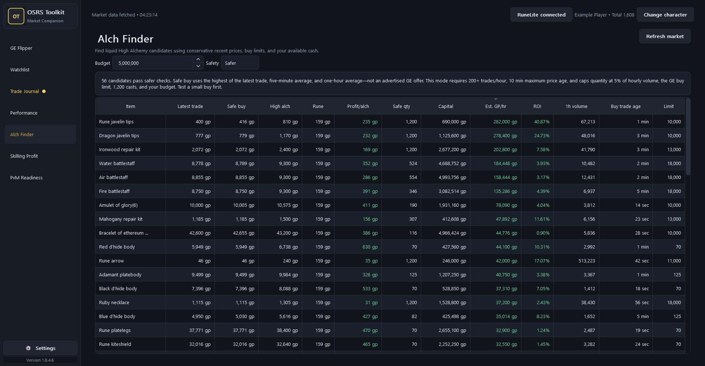](docs/images/alch-finder.png)

Alch Finder assumes you'll pay the highest recent price buyers have actually paid — across the
latest, five-minute, and one-hour data — and takes today's nature rune cost off the top. The
**Safer**, **Balanced**, and **Show all** settings control how old and how thinly traded a result
is allowed to be. Suggested quantity is limited by your budget, a sensible share of the hourly
volume, the GE buy limit, and the 1,200 casts you can realistically get through in an hour.

High Level Alchemy needs Magic 55, and every item listed needs the same thing, so there's no
pointless Magic 55 column taking up space.

## Skilling Profit

[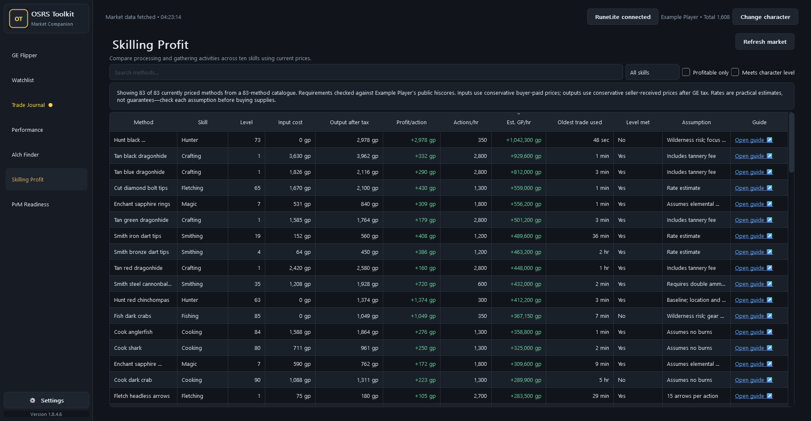](docs/images/skilling-profit.png)

**83 processing and gathering methods across 10 skills**: Cooking, Crafting, Fishing, Fletching,
Herblore, Hunter, Magic, Mining, Smithing, and Woodcutting.

- Search by method, filter by skill, show only the profitable ones, or connect a character to hide
  everything above its levels on the hiscores.
- Supplies are costed at what you'd realistically pay; output is valued at what you'd realistically
  get, after GE tax.
- Shows input cost, output value, profit per action, a realistic actions-per-hour rate, estimated
  GP per hour, the level you need, and how old the oldest price used was.
- Every method links to a real OSRS Wiki training guide.
- Notes flag the things that ruin the maths: burn rates, fixed fees, staves and tools you need,
  Wilderness risk, and rates that depend on your route, gear, competition, or how closely you're
  watching.

These are realistic baselines, not promises. Buy a few supplies and sell a few outputs before you
commit a big stack to anything.

## PvM Readiness

[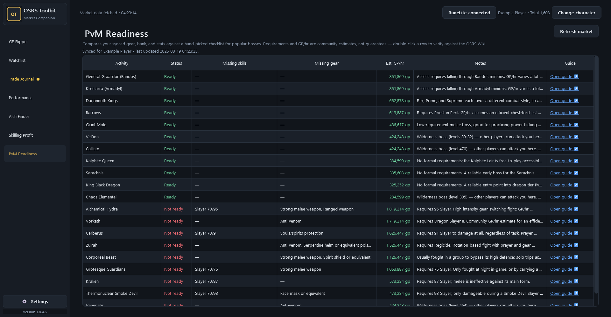](docs/images/pvm-readiness.png)

Turn on PvM gear sync in the RuneLite plugin settings and open your bank in-game. Next time the
toolkit imports, it checks your worn gear, inventory, bank, and levels against hand-written
checklists for **20 bosses**: Vorkath, Zulrah, General Graardor, Kree'arra, Cerberus, King Black
Dragon, Giant Mole, Barrows, Kalphite Queen, Dagannoth Kings, Corporeal Beast, Thermonuclear Smoke
Devil, Kraken, Alchemical Hydra, Grotesque Guardians, Sarachnis, Vet'ion, Callisto, Venenatis, and
Chaos Elemental.

- Ready or not ready for each boss, exactly which levels and which items you're short, and a rough
  GP/hr.
- That GP/hr takes live prices for prayer potions and food off a community estimate of what the
  boss drops, so it moves as prices move. Hover a row to see the sums. The requirements and the
  loot estimate are **hand-curated community numbers**, not a real drop simulation — use them as a
  starting point, not the final word.
- Gear is matched by name across what you're wearing, carrying, and banking. If it's one bank trip
  away, it counts.
- Double-click a boss to open its Wiki page and check the requirements yourself.

## Market data: fetch time vs. trade age

**Market data fetched • 14:03:03** means the app got the newest data from the OSRS Wiki price API
at that time. It does not mean every item traded at 14:03:03.

Quiet items might not have traded for half an hour, two hours, or longer. The **Oldest trade**,
**Buy trade age**, and **Oldest trade used** columns tell you how old the real trades behind each
result are. For a skilling method, that's whichever ingredient or output has gone longest without
trading. So a fresh download can still contain old prices — that's the truth about the item, not a
bug in the app.

Prices are downloaded once and shared by every page. Refreshing by hand greys out the refresh
buttons until it's done, leaves the window usable, and redraws whatever page you're on. If the API
is down, the app falls back to the last copy it saved and says so with **Cached market data
loaded**.

## Daily-use details

- **Money reads the way you'd expect.** Profit is green, real losses are red, zero is neither. What
  you spent on supplies isn't dressed up as a loss.
- **Tables behave.** They spread out in a big window, stay readable in a small one, scroll sideways
  smoothly, and every column sorts.
- **The interface is all of a piece** — buttons, dropdowns, checkboxes, and scrollbars that match
  each other and the theme you picked.
- **Search works like search.** A clear button when there's something to clear, Escape to empty it,
  and the usual copy and paste shortcuts.
- **Keyboard shortcuts.** `Ctrl+1` to `Ctrl+7` for the seven pages in sidebar order, `F5` to
  refresh prices — check one number and get back to the game.
- **Four themes:** Dark, Midnight, Light, and Old School. That last one is carved stone panels,
  square corners, and the game's own orange, so the app doesn't look like it wandered in from
  another program.
- **Character lookup.** Type a display name to pull total level and filter skilling methods by it.
  It reads the public hiscores; it never logs into anything.

## Updates, privacy, and game boundaries

[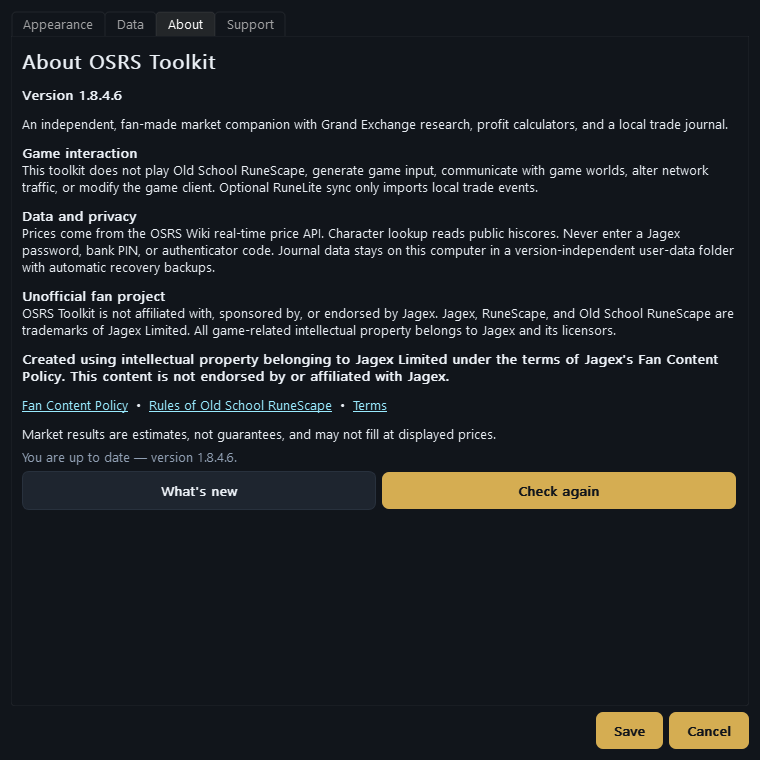](docs/images/settings-about.png)

The app quietly checks for a new release when it starts. If you're up to date you'll never know it
happened. If there is a new version, a window offers to install it, remind you later, or skip that
one. You can also check whenever you like from **Settings → About**. Either way it downloads from
the official GitHub release and checks it against GitHub's own SHA-256 before replacing anything.

An installed copy updates itself: it closes, writes the new version into the same folder, and
reopens on it. No installer to click through, no second window asking something you already
answered. An all-users install stays all-users and a per-user install stays per-user, so you never
end up with a stray second copy. Portable copies are the exception — they get offered the setup
wizard, because for them it's a real question: it makes a proper installed copy and leaves your
portable folder alone.

After an update, a **What's new** window shows that version's changes once, straight from the
bundled [changelog](CHANGELOG.md). It's still there in **Settings → About** afterwards.

Your journal, imported trades, settings, watchlists, and cached prices all live in local folders on
your PC. Prices come from the OSRS Wiki API, update checks from GitHub Releases, and character
lookups from the public hiscores. OSRS Toolkit never asks for or stores a Jagex password, bank PIN,
authenticator code, or anything else that gets you into the game. If you find a security problem,
the [security policy](SECURITY.md) says how to report it.

## Quick start

1. Install the app, or unzip the portable version.
2. Open **OSRS Toolkit**. Prices load on their own.
3. Put the GP you want to trade with in **Cash stack** and set how many **GE slots** are free.
4. Pick Quick, Balanced, or Overnight, then look over the targets, sizes, and confidence.
5. Track the set you like, then go and place the offers in-game and be patient with them.
6. Record what fills by hand, or install the companion RuneLite plugin and let it do it for you.

## Attribution, risk, and license

Prices come from the
[OSRS Wiki real-time price API](https://oldschool.runescape.wiki/w/RuneScape:Real-time_Prices).
GE prices move, odd trades can skew what the data shows, and an offer at a suggested price may
simply never fill. Everything here is an estimate, not guaranteed profit.

OSRS Toolkit is an independent, unofficial fan project. It isn't affiliated with, sponsored by, or
endorsed by Jagex. Jagex, RuneScape, and Old School RuneScape are trademarks of Jagex Limited, and
the game's intellectual property belongs to Jagex and its licensors.

**Created using intellectual property belonging to Jagex Limited under the terms of Jagex's
[Fan Content Policy](https://legal.jagex.com/docs/policies/fan-content-policy). This content is
not endorsed by or affiliated with Jagex.** See also the
[Rules of Old School RuneScape](https://legal.jagex.com/docs/rules/rules-of-old-school-runescape)
and [Jagex Terms](https://legal.jagex.com/docs/terms/terms-and-conditions/current).

OSRS Toolkit is licensed under the [GNU General Public License v3.0](LICENSE).
